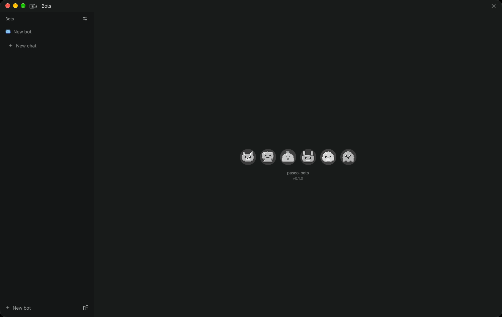
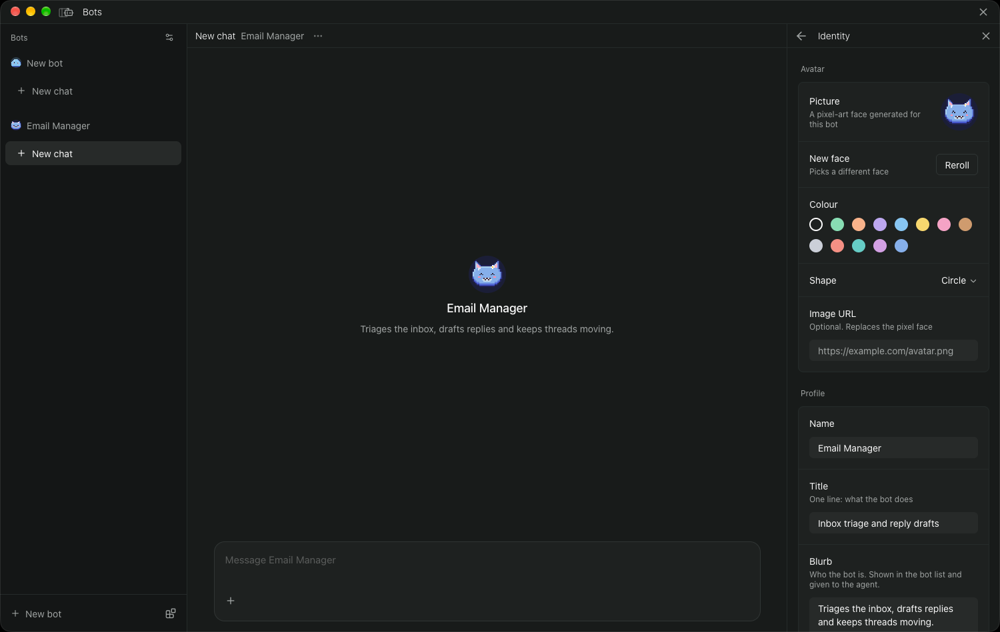
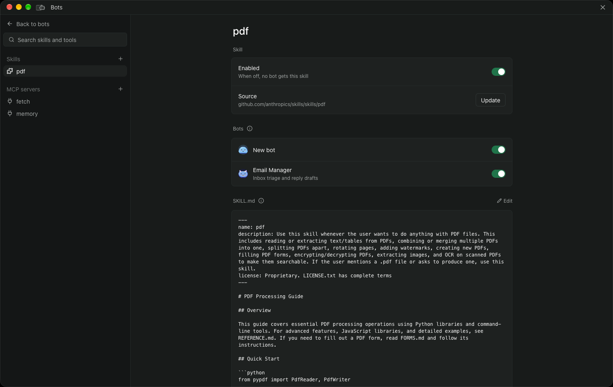
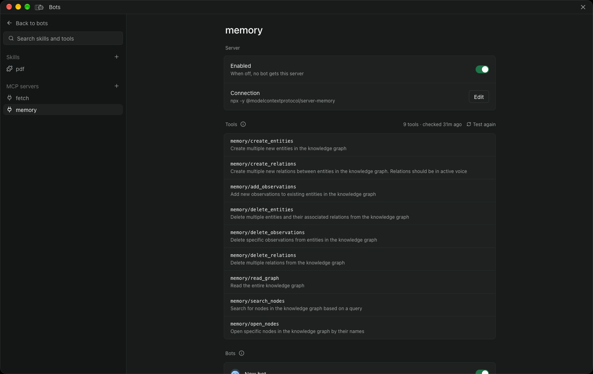

# paseo-bots

Personal bots for [Paseo](https://paseo.sh). Give each bot instructions, a model, skills and MCP tools, then chat with it in its own workspace.

## Install

```bash
paseo plugin install github:oliexe/paseo-bots
```

Requires Paseo 0.9.2 or later.

## Screenshots

| Bots | Bot settings |
| --- | --- |
|  |  |
| **Skills** | **MCP servers** |
|  |  |
